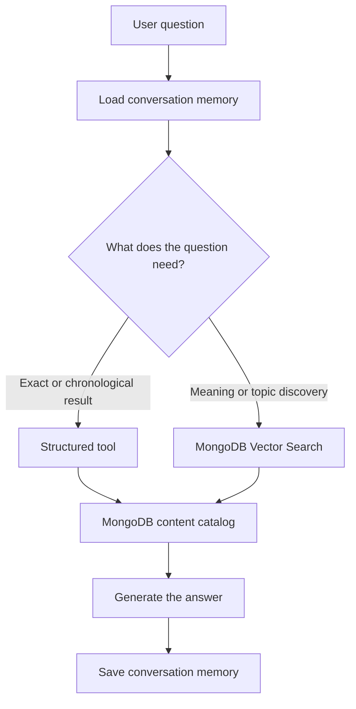

 # Personal Content AI

A small AI assistant that helps people discover Ricardo Mello's professional background, articles, videos, talks, events, and projects.

Try it live at [ricardohsmello.com/ask-ai](https://www.ricardohsmello.com/ask-ai).

## How it works

The assistant keeps recent conversation history in MongoDB and selects the most appropriate capability for each question:

- Structured tools for exact operations such as ordering, counting, date ranges, and upcoming events.
- Semantic search for questions about topics, meaning, explanations, and content discovery.
- Conversation memory for maintaining context across recent messages.



## Technology

- Java 21
- Spring Boot 4
- Spring AI 2
- OpenAI models and embeddings
- MongoDB Atlas
- MongoDB Vector Search
- Maven
- Docker

## Deployment

The application is packaged as a container and runs on Google Cloud Run. MongoDB Atlas stores the content catalog, embeddings, and conversation memory.

## Run locally

Set the required environment variables:

```bash
export OPENAI_API_KEY=your-openai-api-key
export MONGODB_URI=your-mongodb-connection-string
export MONGODB_DATABASE=personal_content
```

Start the application:

```bash
mvn spring-boot:run
```

The API runs on `http://localhost:8080` by default.

```http
POST /chat
Content-Type: application/json

{
  "message": "What is Ricardo's latest article?",
  "conversationId": "example-conversation"
}
```
