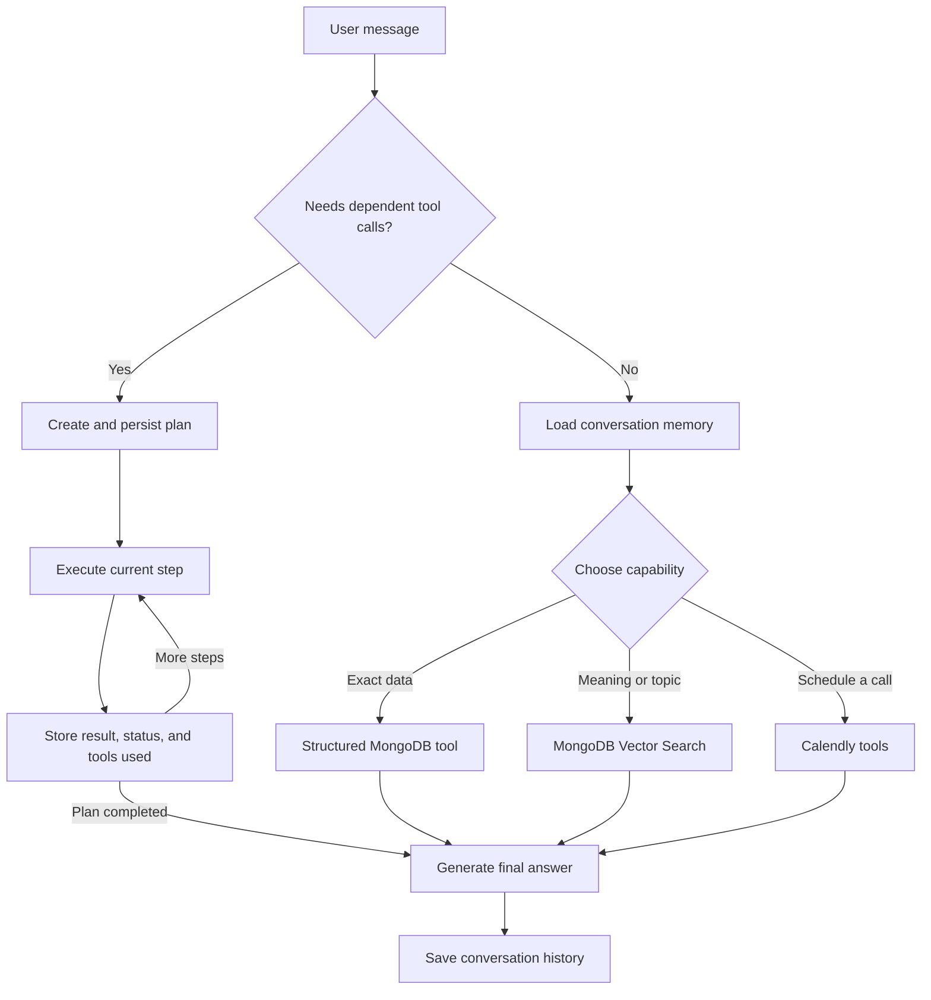

# RicAI — Personal Content Agent

RicAI is an AI agent that helps people discover Ricardo Mello's professional background, articles, videos, talks, events, and projects. It combines RAG, structured tools, conversation memory, multi-step planning, and Calendly integration.

Try it live at [ricardohsmello.com/ask-ai](https://www.ricardohsmello.com/ask-ai).

## How it works

Each message first passes through a router that decides whether it can be handled directly or requires a multi-step plan.

- **Direct requests:** the assistant loads recent conversation memory and selects the appropriate tool. Structured MongoDB queries handle exact operations such as counting, ordering, date ranges, professional experience, and events. MongoDB Vector Search handles discovery by meaning or topic.
- **Multi-step research:** when one operation depends on the result of another, the assistant creates a short plan, persists it in MongoDB, executes one step at a time, and stores each result, status, timestamp, and tool used.
- **Scheduling:** the assistant can find available Calendly times and create a scheduling link. Operations with an external side effect require explicit user confirmation.

Simple selection and formatting do not create a plan. For example, finding the penultimate video is one structured lookup; finding events and then searching for articles related to each event requires a plan.



MongoDB Atlas stores the content catalog, vector embeddings, conversation history, and execution plans. The application is reactive: it plans and acts in response to user messages rather than running autonomous background goals.

## Technology

- Java 21
- Spring Boot 4
- Spring AI
- OpenAI models and embeddings
- MongoDB Atlas
- Maven
- Docker

## Deployment

The application is packaged as a Docker container and runs on Google Cloud Run.

## Run locally

Set the required environment variables:

```bash
export OPENAI_API_KEY=your-openai-api-key
export MONGODB_URI=your-mongodb-connection-string
export MONGODB_DATABASE=personal_content
```

Start the application:

```bash
mvn spring-boot:run
```

The API runs on `http://localhost:8080` by default.

```http
POST /chat
Content-Type: application/json

{
  "message": "What is Ricardo's latest article?",
  "conversationId": "example-conversation"
}
```
